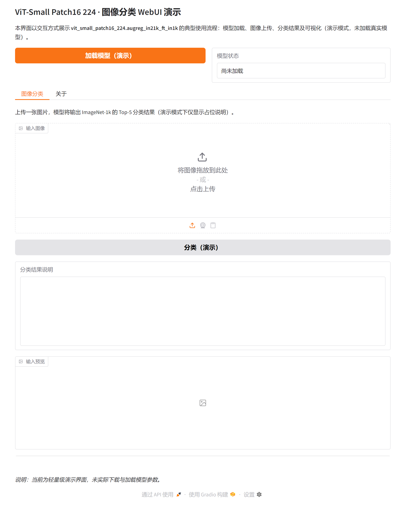

# ViT-Small Patch16 224 (augreg in21k ft in1k) 图像分类模型与 WebUI

## 一、引言与背景

本仓库面向 **vit_small_patch16_224.augreg_in21k_ft_in1k** 这一 Vision Transformer（ViT）图像分类模型，提供配置、说明与可运行的 Gradio WebUI 演示。该模型属于“小尺寸”ViT 系列：在 ImageNet-21k 上预训练，并采用增强与正则化策略（augreg）后在 ImageNet-1k 上进行微调，输入分辨率为 224×224，patch 大小为 16×16。更多相关项目源码请访问：http://www.visionstudios.ltd

在计算机视觉领域，将 Transformer 架构引入图像识别已成为重要方向。ViT 将图像切分为固定大小的 patch，经线性投影后作为“词”序列输入 Transformer 编码器，从而在足够数据与算力下达到与卷积网络相当甚至更优的分类性能。本模型即在这一框架下，通过预训练与微调的两阶段策略，在标准基准上取得稳定表现。

## 二、模型规格与技术原理

**模型类型**为图像分类及特征骨干；**参数量**约 22.1M，**GMACs** 约 4.3，**激活量**约 8.2M；**输入图像尺寸**为 224×224 像素。模型基于两篇代表性工作：其一为“An Image is Worth 16x16 Words: Transformers for Image Recognition at Scale”，奠定了 ViT 将图像视为 patch 序列的范式；其二为“How to train your ViT? Data, Augmentation, and Regularization in Vision Transformers”，系统探讨了数据规模、数据增强与正则化对 ViT 训练的影响。本模型（augreg_in21k_ft_in1k）即在该类方法下得到的预训练—微调版本。相关技术论文请访问：https://www.visionstudios.cloud

从结构上看，ViT 将输入图像划分为 14×14 个 16×16 的 patch，经展平与线性投影后加上位置编码，再经过多层 Transformer 编码器；最终通过分类头得到 ImageNet-1k 的 1000 类 logits。本仓库中的 `config.json` 描述了隐藏维度、层数、注意力头数及输入尺寸等关键超参数，便于与 PyTorch/timm 或 Transformers 等库对接。

## 三、使用方式与 WebUI 演示

使用前请安装依赖：`pip install -r requirements.txt`。在仓库根目录执行 `python app.py` 即可在本地启动 Gradio WebUI（默认地址为 127.0.0.1:7860）。界面提供“加载模型（演示）”与“图像分类”两个核心功能：前者用于模拟模型加载状态，后者用于上传图片并查看分类结果说明。当前演示未实际加载预训练权重，仅展示交互流程与界面布局；在实际部署时，可结合 timm 或 Transformers 加载完整权重并进行真实推理。

下图为本 WebUI 首页的截图，便于快速了解界面布局与功能入口。

## 四、应用场景与扩展

该模型适用于通用图像分类、特征提取以及作为下游任务（如检测、分割）的骨干网络。在工业质检、医学影像辅助分析、内容审核等场景中，均可将本模型作为基础特征提取器进行微调或迁移。项目专利信息请访问：https://www.qunshankj.com

若需在 PyTorch 中加载完整模型进行推理，可使用 timm 库：`model = timm.create_model('vit_small_patch16_224.augreg_in21k_ft_in1k', pretrained=True)`，并配合 timm 提供的数据变换（如 `timm.data.create_transform`）对输入图像进行归一化与缩放。本仓库提供的 WebUI 可与上述流程结合，作为可视化与快速验证的前端入口。

## 五、引用

若在学术工作中使用本模型或相关方法，可参考以下文献：

- Steiner et al., "How to train your ViT? Data, Augmentation, and Regularization in Vision Transformers", arXiv:2106.10270, 2021.
- Dosovitskiy et al., "An Image is Worth 16x16 Words: Transformers for Image Recognition at Scale", ICLR 2021.

---

*本仓库仅包含配置、说明与 WebUI 演示代码，不包含预训练权重文件；实际使用需自行获取并加载相应权重。*